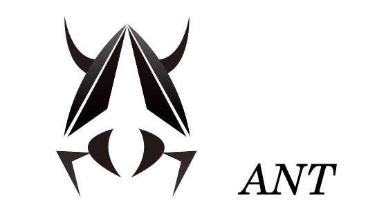
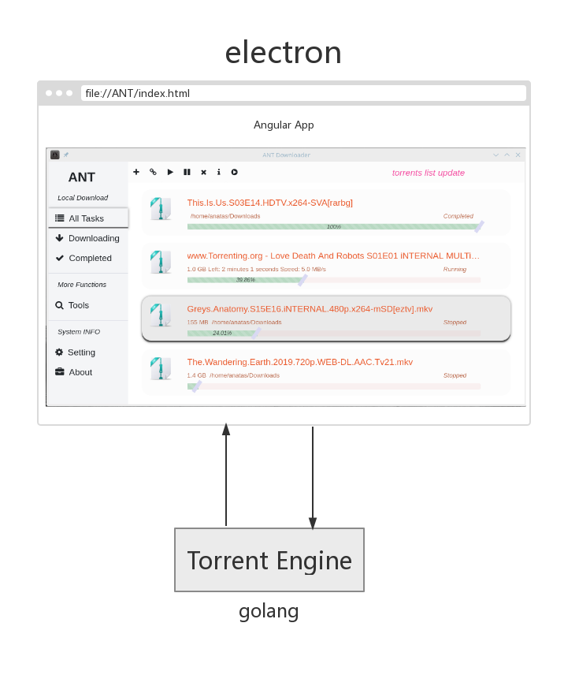
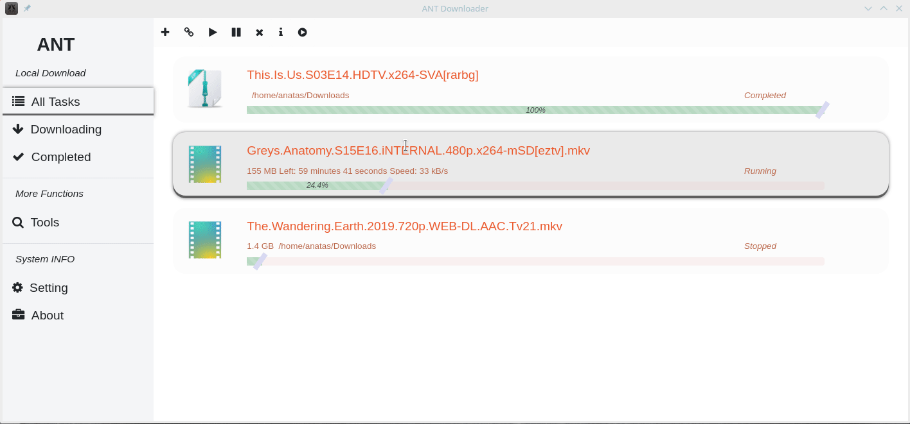
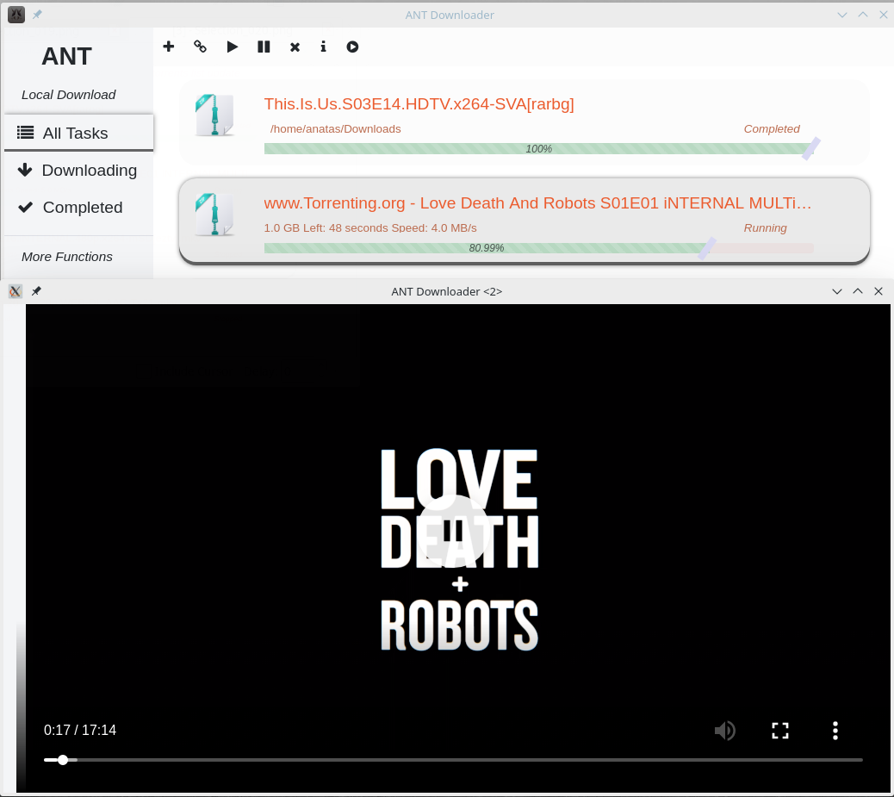

## ANT Downloader

[](https://travis-ci.com/anatasluo/ant)
[](https://img.shields.io/badge/version-1.1.0-blueviolet.svg)
[](https://opensource.org/licenses/MPL-2.0)

### [English](README.md) | [中文](README_zh.md)

> ANT Downloader(蚂蚁下载器) 是一个由go语言， angular7 和 electron开发的BitTorrent下载客户端。 ANT Downloader致力于利用最少的系统资源， 提供最佳的种子下载体验。

如果你喜欢这个应用，请考虑给项目一颗star.

## 为什么你应该考虑使用 ANT Downloader:
- 一个面向全平台的下载器
- 一个界面简洁美观的下载器
- 一个资源占用低，开箱即用的下载器
- 一个功能丰富的下载器，边放边播，种子检索应有尽有
- ANT 集成了很多公用的种子服务，来提供更好的体验，包括
  - [itorrents](https://itorrents.org/)
  - [trackerslist](https://github.com/ngosang/trackerslist)
  - [thepiratebay](https://www.thepiratebay.org/)
  - ...

## 新版本将会考虑的特性:
- [ ] 下载或者缓存特地文件 (目前版本会下载全部文件，并且只缓存一个任务中体积最大的文件)
- [ ] 支持不同的UI主题
- [ ] 支持更多的下载方式，包括ed2k, webTorrent
- [ ] 远程控制ANT下载器

## TODO List
- Add support for network speed limit
- Add support for maximum number of download task

## 项目架构:


## 应用预览:
+ ### 添加下载任务

--------------

+ ### 边放边播

--------------

## 开始使用

你可以直接下载打包好的文件，从 [Release](https://github.com/anatasluo/ant/releases)界面

你也可以根据你自己的系统，架构，通过以下命令自行编译
```
npm run electron:linux
```

```
npm run electron:windows
```

```
npm run electron:mac
```

更多npm脚本用法，请参考 package.json, 确保你的系统满足以下依赖：
+ node >= 11.0.x
+ golang >= 1.10.x

# 特别致谢

+ [anacrolix/torrent](https://github.com/anacrolix/torrent)
+ [goTorrent](https://github.com/deranjer/goTorrent)
+ [go-peerflix](https://github.com/Sioro-Neoku/go-peerflix)
+ [cloud-torrent](https://github.com/jpillora/cloud-torrent)

# 联系我
你可以发邮件到 luolongjuna@gmail.com
